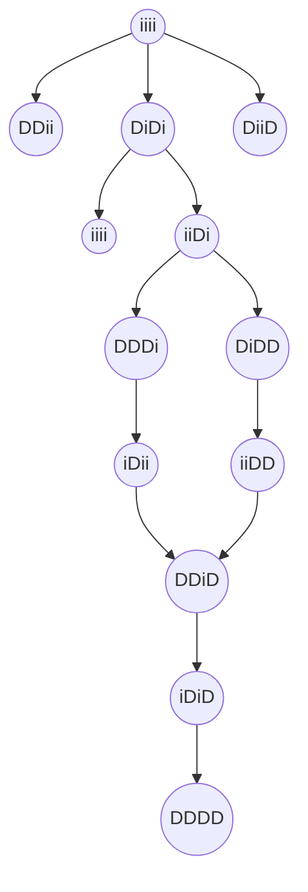

```mermaid
graph TD

    n1((iiii)) --> n2((DDii))
    n1 --> n3((DiDi))
    n1 --> n4((DiiD))

    n3 --> n5((iiii))
    n3 --> n6((iiDi))

    n6 --> n7((DDDi))
    n6 --> n8((DiDD))

    n7 --> n9((iDii))
    n8 --> n10((iiDD))

    n9 --> n11((DDiD))
    n10 --> n11

    n11 --> n12((iDiD))

    n12 --> n13((DDDD))
```