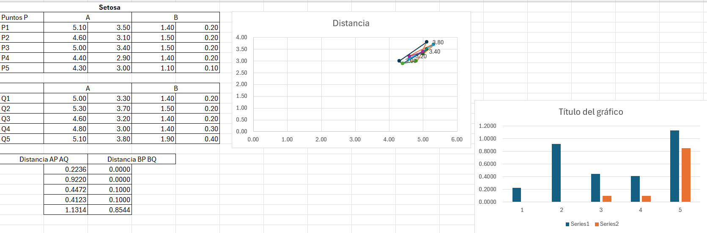
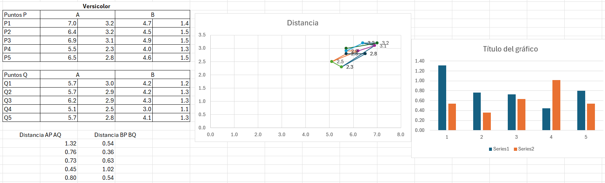
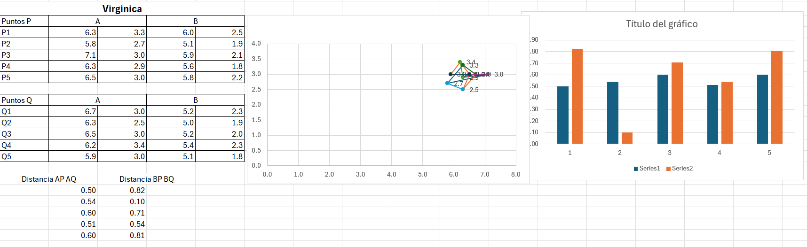

# Analisis distancia euclidiana

## 1. Análisis de Iris Setosa
*   **Comportamiento de los datos:** Al observar las tablas de la Setosa, notamos que los valores del grupo "B" (Pétalos) son extremadamente pequeños y constantes (rondando el 1.4 - 1.5 y 0.2).
*   **Distancias Euclidianas:**
    *   La **Distancia BP BQ** (barras naranjas) es prácticamente nula en los primeros pares (0.0000) y muy baja en los demás. Esto indica que los últimos registros de Setosa son casi idénticos a los primeros en cuanto a sus características "B".
    *   La **Distancia AP AQ** (barras azules) muestra un poco más de variación (hasta 1.13), lo que significa que el tamaño de los sépalos varía más que el de los pétalos dentro de esta misma especie.
*   **Gráfica de dispersión:** Los puntos están muy agrupados y concentrados en una zona específica, lo que visualmente confirma que esta clase es muy compacta y sus muestras son muy similares entre sí.

## 2. Análisis de Iris Versicolor
*   **Comportamiento de los datos:** Aquí los valores base aumentan significativamente en comparación con la Setosa. Los valores "B" ya no son cercanos a cero, rondando los 4.0 y 1.3.
*   **Distancias Euclidianas:**
    *   Se observa una **mayor variabilidad (dispersión)**. La gráfica de barras muestra que las distancias, tanto para "A" (barras azules) como para "B" (barras naranjas), son en promedio mucho más altas que en la Setosa.
    *   Por ejemplo, el primer par tiene una distancia en "A" de 1.32, y el cuarto par tiene una distancia en "B" de 1.02. Esto significa que dentro de la misma especie Versicolor, la primera flor y la última flor difieren bastante en sus medidas.
*   **Conclusión de la clase:** La clase Versicolor es mucho menos uniforme que la Setosa. Sus muestras están más dispersas en el espacio, lo que es congruente con el comportamiento típico de este dataset.

## 3. Análisis de Iris Virginica
*   **Comportamiento de los datos:** Esta es la especie con los valores absolutos más grandes (valores de "A" frecuentemente por encima de 6.0 y "B" por encima de 5.0).
*   **Distancias Euclidianas:**
    *   Lo más destacable en la gráfica de barras es el comportamiento de la **Distancia BP BQ** (barras naranjas). En los pares 1, 3 y 5, la distancia euclidiana de las características "B" supera a la de las características "A".
    *   Las distancias de "A" (barras azules) son notablemente estables (oscilan muy poco, entre 0.50 y 0.60).
*   **Conclusión de la clase:** En la Virginica, las proporciones de los sépalos (A) entre los primeros y últimos datos se mantienen relativamente constantes (baja distancia euclidiana), pero las dimensiones de los pétalos (B) sufren cambios mucho más drásticos e irregulares (picos altos en las barras naranjas).

## Conclusión General del Análisis
El cálculo de la distancia euclidiana intra-clase (comparar una especie consigo misma) revela la **dispersión o varianza** de cada tipo de flor:
1.  **Setosa** es la clase más pura y agrupada; sus diferencias internas (especialmente en los valores B) son minúsculas.
2.  **Versicolor** es una clase más inestable, con distancias internas altas tanto en los valores A como en los B.
3.  **Virginica** muestra que, aunque una parte de su estructura (A) puede ser constante, la otra parte (B) puede variar fuertemente de una muestra a otra.